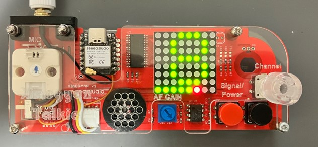

# XIAOGYAN Talkie ：WiFi音声トランシーバ
[XIAOGYAN](https://github.com/algyan/XIAOGYAN) (IoT ALGYAN 8周年記念ボード)で動作するWiFi音声トランシーバのサンプルコードです。2.4GHz WiFiの電波の電波で音声通信ができるライセンスフリーのトランシーバです。Espressif社のESPNOWプロトコル（Long Range Mode）を使用し、最大1kmの距離で音声通信が可能です。

## 諸元
- 送受信周波数	：2412～2472MHz(5MHz間隔13波)
- 電波形式	：G1D, D1D
- 送信出力	：4.7mW/MHz
- 受信感度	：約-90dBm
- 音声出力	：約0.2W
- プロトコル	：ESPNOW Long Range Mode（Espressif）
- 通信距離	：最大1km（見通し距離）
- 制御マイコン	：XIAO ESP32S3
- 電源	：リチウムポリマー電池　3.7V, 500mA
- 消費電流	：最大120mA（送信時）
- その他	：ライセンスフリー
- 工事設計認証番号：217-230892

## その他
- PlatformIO用のプロジェクトです。
- [XIAOGYAN Support Library](https://github.com/algyan/xiaogyan_arduino)の[Speakerクラス](https://github.com/lipoyang/XiaogyanRadio/tree/main)は、lipoyangさんが公開されているものを使わせてもらっています。
- atomic14氏の[ESP32-walkie-talkie](https://github.com/atomic14/esp32-walkie-talkie)のプロジェクトから、transportクラス、およびOutputBufferクラスを改造して使用させてもらっています。

※ XIAO ESP32「S3」用です。「C3」ではうまく動作しません。
